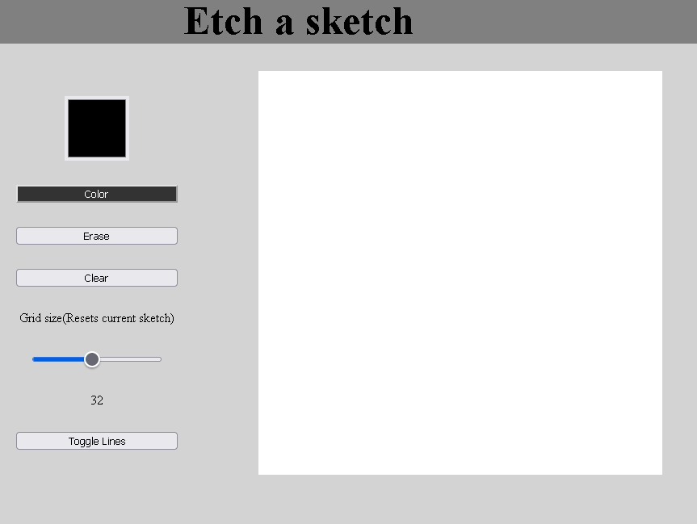

[Etch a Sketch](https://elvis-visi.github.io/etch-a-sketch/)

Etch-a-Sketch web application, which allows users to draw on a grid by hovering the mouse over the cells. The user can change the grid size, the color of the pen, and can also erase, clear the entire grid. The application is built using HTML, CSS, and JavaScript.

